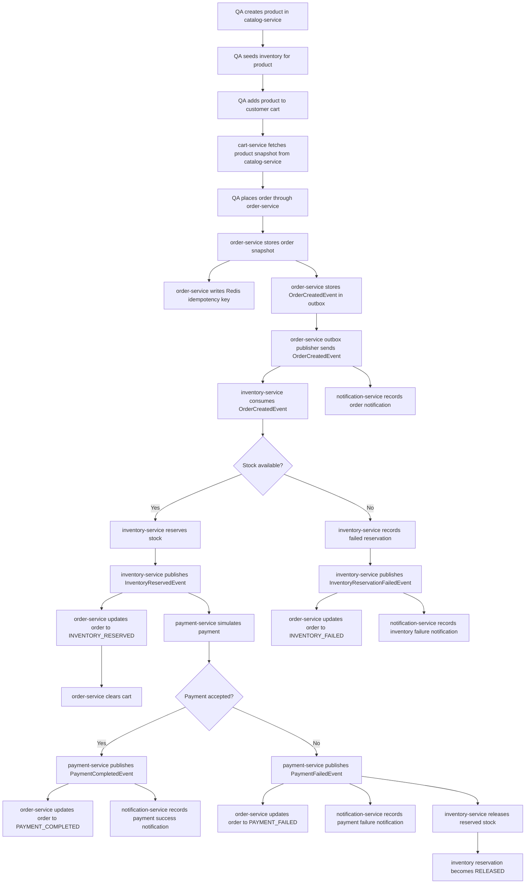

# EventCart QA And New Joiner Application Flow Guide

This is the living handoff guide for QA engineers and new joiners. It explains the current EventCart application flow, the order in which APIs should be called, and how to verify results through APIs, MongoDB, Redis, Kafka, and logs.

Last updated: 2026-08-02

## Purpose

Use this document when you need to:

- Understand the current end-to-end business flow.
- Execute the APIs in the correct order.
- Verify where data is stored after each step.
- Debug common local issues such as empty carts, missing stock, duplicate order retries, authorization failures, DLQ messages, and Kafka processing delays.
- Onboard a new team member to the current service boundaries.

## Current Scope

The current working slice covers API Gateway routing, Keycloak JWT security, product catalog, cart, order placement, outbox publishing, inventory reservation, payment simulation, notification history, Redis idempotency, Kafka retry/DLQ handling, and Kafka-based order status updates.

| Area | Current state |
| --- | --- |
| Product catalog | Create, read, search, update, and deactivate products |
| Cart | Add, update, remove, clear, and read customer carts |
| Orders | Place order from cart, store order snapshot, publish `OrderCreatedEvent` |
| Inventory | Seed stock, consume order events, reserve stock, publish reservation result events |
| Payments | Consume inventory success events, simulate payment, publish payment result events |
| Notifications | Consume order/payment events and store customer notification history |
| API Gateway | Route client APIs and enforce JWT role checks |
| Security | Keycloak realm with `ADMIN`, `CUSTOMER`, and `SUPPORT` roles |
| Outbox | Store order-created events before Kafka publication |
| Kafka retry/DLQ | Retry failed consumers and route exhausted messages to `<topic>.dlq` |
| Order status | Consume inventory and payment result events and update order status |
| Redis | Store order idempotency keys for safe order-placement retries |
| OpenAPI | Swagger UI available for all implemented services |

## Services And Local Ports

| Service | Port | Main responsibility | Data store |
| --- | --- | --- | --- |
| catalog-service | 8081 | Owns product data | MongoDB `eventcart_catalog.products` |
| cart-service | 8082 | Owns customer cart state | MongoDB `eventcart_cart.carts` |
| order-service | 8083 | Owns order lifecycle | MongoDB `eventcart_order.orders`, Redis idempotency keys |
| inventory-service | 8084 | Owns stock and reservations | MongoDB `eventcart_inventory.inventory_items`, `eventcart_inventory.inventory_reservations` |
| payment-service | 8085 | Owns mock payment attempts | MongoDB `eventcart_payment.payment_attempts` |
| notification-service | 8086 | Owns customer notifications | MongoDB `eventcart_notification.notifications` |
| api-gateway | 8080 | Single secured entry point | Routes to backend services |
| MongoDB | 27017 | Local document database | Docker container `eventcart-mongodb` |
| Kafka | 9092 | Local event broker | Docker container `eventcart-kafka` |
| Redis | 6379 | Local cache/key-value store | Docker container `eventcart-redis` |
| Keycloak | 8088 | Local identity provider | Docker container `eventcart-keycloak` |

## High-Level Flow



## Start The Application Locally

Run all commands from the project root:

```powershell
cd C:\Users\HP\Documents\Study\EventCart
```

Start infrastructure:

```powershell
docker compose up -d
```

Verify containers:

```powershell
docker compose ps
```

Start services in separate terminals, in this order:

```powershell
.\mvnw.cmd -pl services/catalog-service spring-boot:run
.\mvnw.cmd -pl services/cart-service spring-boot:run
.\mvnw.cmd -pl services/order-service spring-boot:run
.\mvnw.cmd -pl services/inventory-service spring-boot:run
.\mvnw.cmd -pl services/payment-service spring-boot:run
.\mvnw.cmd -pl services/notification-service spring-boot:run
.\mvnw.cmd -pl services/api-gateway spring-boot:run
```

The startup order matters for manual testing because cart-service calls catalog-service, order-service calls cart-service, api-gateway routes to every backend service, and inventory/order/payment/notification communicate through Kafka.

## Security Tokens

Keycloak imports realm `eventcart` from `ops/keycloak/eventcart-realm.json`.

Use an admin token for product and inventory management:

```powershell
$tokenResponse = Invoke-RestMethod -Method Post `
  -Uri "http://localhost:8088/realms/eventcart/protocol/openid-connect/token" `
  -ContentType "application/x-www-form-urlencoded" `
  -Body "grant_type=password&client_id=eventcart-gateway&username=admin-user&password=admin"

$adminToken = $tokenResponse.access_token
```

Use a customer token for cart, order, and notification APIs:

```powershell
$tokenResponse = Invoke-RestMethod -Method Post `
  -Uri "http://localhost:8088/realms/eventcart/protocol/openid-connect/token" `
  -ContentType "application/x-www-form-urlencoded" `
  -Body "grant_type=password&client_id=eventcart-gateway&username=customer-user&password=customer"

$customerToken = $tokenResponse.access_token
```

The curl examples below show `<admin-token>` or `<customer-token>`. Replace those placeholders with the token value or call the same API through PowerShell using the variables above.

## Health Checks

Before running the business flow, verify that every service is up:

```bash
curl http://localhost:8081/actuator/health
curl http://localhost:8082/actuator/health
curl http://localhost:8083/actuator/health
curl http://localhost:8084/actuator/health
curl http://localhost:8085/actuator/health
curl http://localhost:8086/actuator/health
curl http://localhost:8080/actuator/health
```

Expected result: each service returns `UP`.

## OpenAPI Links

| Service | Swagger UI |
| --- | --- |
| catalog-service | `http://localhost:8081/swagger-ui.html` |
| cart-service | `http://localhost:8082/swagger-ui.html` |
| order-service | `http://localhost:8083/swagger-ui.html` |
| inventory-service | `http://localhost:8084/swagger-ui.html` |
| payment-service | `http://localhost:8085/swagger-ui.html` |
| notification-service | `http://localhost:8086/swagger-ui.html` |
| api-gateway | `http://localhost:8080/swagger-ui.html` |

## Happy Path API Sequence

Use this sequence for the main QA smoke test.

### Step 1: Create A Product

Call catalog-service:

```bash
curl -X POST \
  http://localhost:8081/api/v1/products \
  -H "Authorization: Bearer <admin-token>" \
  -H "Content-Type: application/json" \
  -d '{
    "sku": "SKU-1001",
    "name": "Mechanical Keyboard",
    "description": "Hot-swappable keyboard with RGB lighting",
    "category": "Electronics",
    "price": 6999.00,
    "currency": "INR",
    "availableQuantity": 25,
    "tags": ["keyboard", "gaming", "rgb"]
  }'
```

Expected API result:

- Response code is 200.
- Response contains `data.productId`.
- Save the returned product ID for the next steps.

Example product ID:

```text
6a6f2ff6c33ef72269887fec
```

Verify through API:

```bash
curl http://localhost:8081/api/v1/products/<product-id>
```

Verify through MongoDB:

```powershell
docker exec -it eventcart-mongodb mongosh -u eventcart -p eventcart --authenticationDatabase admin
```

Then in `mongosh`:

```javascript
use eventcart_catalog
db.products.find({ sku: "SKU-1001" }).pretty()
```

Expected MongoDB result: one product document exists in `eventcart_catalog.products`.

### Step 2: Seed Inventory For The Same Product

Call inventory-service:

```bash
curl -X PUT \
  http://localhost:8084/api/v1/inventory/<product-id> \
  -H "Authorization: Bearer <admin-token>" \
  -H "Content-Type: application/json" \
  -d '{
    "sku": "SKU-1001",
    "productName": "Mechanical Keyboard",
    "availableQuantity": 25
  }'
```

Expected API result:

- Response code is 200.
- `availableQuantity` is 25.
- `reservedQuantity` is 0.

Verify through API:

```bash
curl http://localhost:8084/api/v1/inventory/<product-id>
```

Verify through MongoDB:

```javascript
use eventcart_inventory
db.inventory_items.find({ productId: "<product-id>" }).pretty()
```

### Step 3: Check Customer Cart Before Adding Item

Call cart-service:

```bash
curl http://localhost:8082/api/v1/carts/customer-1 \
  -H "Authorization: Bearer <customer-token>"
```

Expected result for a new or cleared customer cart:

- `items` is empty.
- `totalItems` is 0.
- `subtotal` is 0.

### Step 4: Add Product To Cart

Call cart-service:

```bash
curl -X POST \
  http://localhost:8082/api/v1/carts/customer-1/items \
  -H "Authorization: Bearer <customer-token>" \
  -H "Content-Type: application/json" \
  -d '{
    "productId": "<product-id>",
    "quantity": 2
  }'
```

Important behavior:

- The client sends only `productId` and `quantity`.
- cart-service calls catalog-service to fetch product name, SKU, price, currency, and active status.
- cart-service stores a product snapshot in the cart document.

Expected API result:

- Cart contains one item.
- `totalItems` is 2.
- `subtotal` is `13998.00` when price is `6999.00` and quantity is 2.

Verify through API:

```bash
curl http://localhost:8082/api/v1/carts/customer-1 \
  -H "Authorization: Bearer <customer-token>"
```

Verify through MongoDB:

```javascript
use eventcart_cart
db.carts.find({ customerId: "customer-1" }).pretty()
```

Expected MongoDB result: cart document contains embedded item snapshot fields such as `productId`, `sku`, `productName`, `unitPrice`, `currency`, `quantity`, and `lineTotal`.

### Step 5: Place Order From Cart

Call order-service:

```bash
curl -X POST \
  http://localhost:8083/api/v1/orders \
  -H "Authorization: Bearer <customer-token>" \
  -H "Content-Type: application/json" \
  -d '{
    "customerId": "customer-1",
    "idempotencyKey": "customer-1-order-20260802-001"
  }'
```

Important behavior:

- order-service uses Redis to reserve the idempotency key.
- order-service calls cart-service and fetches the customer cart.
- order-service stores an order snapshot in MongoDB.
- order-service stores `OrderCreatedEvent` in MongoDB collection `outbox_events`.
- order-service outbox publisher publishes pending events to Kafka topic `eventcart.orders.created`.
- The initial order API response can return before inventory processing completes.

Expected API result:

- Response code is 200.
- Response contains `data.orderId`.
- `data.status` is usually `CREATED` immediately after placement.
- Save the returned order ID.

Verify through API:

```bash
curl http://localhost:8083/api/v1/orders/<order-id> \
  -H "Authorization: Bearer <customer-token>"
```

Verify through MongoDB:

```javascript
use eventcart_order
db.orders.find({ _id: ObjectId("<order-id>") }).pretty()
db.outbox_events.find({ aggregateId: "<order-id>" }).pretty()
```

Verify Redis idempotency key:

```powershell
docker exec -it eventcart-redis redis-cli
```

Then in `redis-cli`:

```text
KEYS eventcart:orders:idempotency:*
GET eventcart:orders:idempotency:customer-1-order-20260802-001
```

Expected Redis value after order creation:

```text
ORDER:<order-id>
```

### Step 6: Verify Inventory Reservation

Inventory processing is asynchronous. Wait a few seconds, then call inventory-service:

```bash
curl http://localhost:8084/api/v1/inventory/reservations/<order-id> \
  -H "Authorization: Bearer <admin-token>"
```

Expected happy-path result:

- Reservation exists.
- Status is `RESERVED`.
- Items match the order item quantities.
- `totalAmount` and `currency` match the order amount. payment-service uses these fields.

Verify inventory item quantities:

```bash
curl http://localhost:8084/api/v1/inventory/<product-id> \
  -H "Authorization: Bearer <admin-token>"
```

Expected result:

- `reservedQuantity` increased by ordered quantity.
- `availableQuantity` decreased by ordered quantity.

### Step 7: Verify Inventory Order Status Update

Call order-service again:

```bash
curl http://localhost:8083/api/v1/orders/<order-id> \
  -H "Authorization: Bearer <customer-token>"
```

Expected happy-path result:

- `status` becomes `INVENTORY_RESERVED` before payment result processing completes, or it may already be `PAYMENT_COMPLETED` if payment-service and order-service processed the later payment event quickly.
- `statusReason` is null.

If the status is still `CREATED`, inventory-service may still be processing, Kafka may not be running, or order-service may not have consumed the inventory result event yet.

### Step 8: Verify Payment Attempt

payment-service consumes `InventoryReservedEvent` asynchronously. Wait a few seconds, then call payment-service:

```bash
curl http://localhost:8085/api/v1/payments/orders/<order-id> \
  -H "Authorization: Bearer <admin-token>"
```

Expected happy-path result:

- Payment attempt exists.
- `status` is `COMPLETED`.
- `amount` and `currency` match the order.
- `providerTransactionId` starts with `MockPay-`.

Verify through MongoDB:

```javascript
use eventcart_payment
db.payment_attempts.find({ orderId: "<order-id>" }).pretty()
```

Payment simulation rule:

```text
Amounts below 50000.00 complete. Amounts at or above 50000.00 fail.
```

### Step 9: Verify Final Order Status

Call order-service again:

```bash
curl http://localhost:8083/api/v1/orders/<order-id> \
  -H "Authorization: Bearer <customer-token>"
```

Expected happy-path result:

- `status` becomes `PAYMENT_COMPLETED`.
- `statusReason` is null.

If the status is still `INVENTORY_RESERVED`, payment-service may still be processing, Kafka may not be running, or order-service may not have consumed the payment result event yet.

### Step 10: Verify Cart Cleanup

After inventory is successfully reserved, order-service clears the customer cart:

```bash
curl http://localhost:8082/api/v1/carts/customer-1 \
  -H "Authorization: Bearer <customer-token>"
```

Expected result:

- `items` is empty.
- `totalItems` is 0.
- `subtotal` is 0.

## Kafka Verification

List topics:

```powershell
docker exec -it eventcart-kafka /opt/kafka/bin/kafka-topics.sh --bootstrap-server localhost:9092 --list
```

Expected topics include:

```text
eventcart.orders.created
eventcart.inventory.reserved
eventcart.inventory.failed
eventcart.payments.completed
eventcart.payments.failed
eventcart.orders.created.dlq
eventcart.inventory.reserved.dlq
eventcart.inventory.failed.dlq
eventcart.payments.completed.dlq
eventcart.payments.failed.dlq
```

Read order-created messages:

```powershell
docker exec -it eventcart-kafka /opt/kafka/bin/kafka-console-consumer.sh --bootstrap-server localhost:9092 --topic eventcart.orders.created --from-beginning --max-messages 5
```

Read inventory-reserved messages:

```powershell
docker exec -it eventcart-kafka /opt/kafka/bin/kafka-console-consumer.sh --bootstrap-server localhost:9092 --topic eventcart.inventory.reserved --from-beginning --max-messages 5
```

Read inventory-failed messages:

```powershell
docker exec -it eventcart-kafka /opt/kafka/bin/kafka-console-consumer.sh --bootstrap-server localhost:9092 --topic eventcart.inventory.failed --from-beginning --max-messages 5
```

Read payment-completed messages:

```powershell
docker exec -it eventcart-kafka /opt/kafka/bin/kafka-console-consumer.sh --bootstrap-server localhost:9092 --topic eventcart.payments.completed --from-beginning --max-messages 5
```

Read payment-failed messages:

```powershell
docker exec -it eventcart-kafka /opt/kafka/bin/kafka-console-consumer.sh --bootstrap-server localhost:9092 --topic eventcart.payments.failed --from-beginning --max-messages 5
```

Read a DLQ topic when a consumer keeps failing after retries:

```powershell
docker exec -it eventcart-kafka /opt/kafka/bin/kafka-console-consumer.sh --bootstrap-server localhost:9092 --topic eventcart.orders.created.dlq --from-beginning --max-messages 5
```

## Notification Verification

notification-service creates in-app notifications asynchronously from Kafka events.

List customer notifications:

```bash
curl http://localhost:8086/api/v1/notifications/customers/customer-1 \
  -H "Authorization: Bearer <customer-token>"
```

Expected result:

- At least one `ORDER_CREATED` notification exists after order placement.
- A `PAYMENT_COMPLETED` notification exists on the happy path.
- A `PAYMENT_FAILED` notification exists on payment failure.
- An `INVENTORY_FAILED` notification exists on insufficient-stock failure.

Verify through MongoDB:

```javascript
use eventcart_notification
db.notifications.find({ customerId: "customer-1" }).pretty()
```

Mark a notification read:

```bash
curl -X PUT \
  http://localhost:8086/api/v1/notifications/<notification-id>/read \
  -H "Authorization: Bearer <customer-token>"
```

## Negative Flow: Empty Cart

Call order-service without adding items to the cart:

```bash
curl -X POST \
  http://localhost:8083/api/v1/orders \
  -H "Authorization: Bearer <customer-token>" \
  -H "Content-Type: application/json" \
  -d '{
    "customerId": "customer-1",
    "idempotencyKey": "customer-1-empty-cart-test-001"
  }'
```

Expected result:

```json
{
  "code": "EMPTY_CART",
  "message": "Cannot place order because cart is empty for customer: customer-1",
  "path": "/api/v1/orders",
  "details": {}
}
```

How to fix: add at least one product to the cart before placing the order.

## Negative Flow: Insufficient Inventory

Use this to verify failed reservation behavior.

1. Seed inventory with a lower quantity than the cart quantity.
2. Add a higher quantity to the cart.
3. Place the order with a fresh idempotency key.

Example inventory seed:

```bash
curl -X PUT \
  http://localhost:8084/api/v1/inventory/<product-id> \
  -H "Authorization: Bearer <admin-token>" \
  -H "Content-Type: application/json" \
  -d '{
    "sku": "SKU-1001",
    "productName": "Mechanical Keyboard",
    "availableQuantity": 1
  }'
```

Expected result after placing an order with quantity 2:

- inventory-service creates a failed reservation.
- inventory-service publishes `InventoryReservationFailedEvent`.
- order-service updates order status to `INVENTORY_FAILED`.
- order response contains `statusReason`.
- cart is not cleared because inventory was not reserved.

Verify:

```bash
curl http://localhost:8084/api/v1/inventory/reservations/<order-id> -H "Authorization: Bearer <admin-token>"
curl http://localhost:8083/api/v1/orders/<order-id> -H "Authorization: Bearer <customer-token>"
curl http://localhost:8082/api/v1/carts/customer-1 -H "Authorization: Bearer <customer-token>"
```

## Negative Flow: Payment Failure

Use this to verify payment decline behavior.

1. Create or update a product so the order total is at least `50000.00`.
2. Seed enough inventory for the product.
3. Add the product to cart.
4. Place the order with a fresh idempotency key.

Example high-value product:

```bash
curl -X POST \
  http://localhost:8081/api/v1/products \
  -H "Authorization: Bearer <admin-token>" \
  -H "Content-Type: application/json" \
  -d '{
    "sku": "SKU-9001",
    "name": "Premium Workstation",
    "description": "High-value workstation used to test payment failure",
    "category": "Electronics",
    "price": 60000.00,
    "currency": "INR",
    "availableQuantity": 5,
    "tags": ["workstation", "premium"]
  }'
```

Expected result after placing an order:

- inventory-service reserves stock.
- payment-service creates a payment attempt with status `FAILED`.
- payment-service publishes `PaymentFailedEvent`.
- order-service updates order status to `PAYMENT_FAILED`.
- inventory-service consumes `PaymentFailedEvent`.
- inventory-service releases the reserved stock.
- inventory reservation status becomes `RELEASED`.
- order response contains `statusReason`.
- cart is still cleared because inventory was successfully reserved before payment failed.

Verify:

```bash
curl http://localhost:8085/api/v1/payments/orders/<order-id> -H "Authorization: Bearer <admin-token>"
curl http://localhost:8083/api/v1/orders/<order-id> -H "Authorization: Bearer <customer-token>"
curl http://localhost:8082/api/v1/carts/customer-1 -H "Authorization: Bearer <customer-token>"
curl http://localhost:8084/api/v1/inventory/reservations/<order-id> -H "Authorization: Bearer <admin-token>"
curl http://localhost:8084/api/v1/inventory/<product-id> -H "Authorization: Bearer <admin-token>"
```

Expected compensation result:

- Payment attempt status is `FAILED`.
- Order status is `PAYMENT_FAILED`.
- Reservation status is `RELEASED`.
- Inventory `reservedQuantity` decreases by the order quantity.
- Inventory `availableQuantity` increases by the order quantity.

## Negative Flow: Duplicate Order Retry

Use the same `idempotencyKey` after a successful order:

```bash
curl -X POST \
  http://localhost:8083/api/v1/orders \
  -H "Authorization: Bearer <customer-token>" \
  -H "Content-Type: application/json" \
  -d '{
    "customerId": "customer-1",
    "idempotencyKey": "customer-1-order-20260802-001"
  }'
```

Expected result:

- order-service returns the original order for that idempotency key.
- No duplicate order should be created for the same completed key.

If the same key is submitted while the first request is still processing, expected result is:

```json
{
  "code": "DUPLICATE_ORDER_REQUEST",
  "message": "Order request is already being processed for idempotency key: <key>",
  "path": "/api/v1/orders",
  "details": {}
}
```

## Negative Flow: Product Not Available

If a product is inactive, missing, or unavailable from catalog-service, adding it to the cart should fail.

Useful verification:

```bash
curl http://localhost:8081/api/v1/products/<product-id>
curl -X DELETE http://localhost:8081/api/v1/products/<product-id> -H "Authorization: Bearer <admin-token>"
curl -X POST \
  http://localhost:8082/api/v1/carts/customer-1/items \
  -H "Authorization: Bearer <customer-token>" \
  -H "Content-Type: application/json" \
  -d '{
    "productId": "<product-id>",
    "quantity": 1
  }'
```

Expected result: cart-service rejects the request because inactive or missing products cannot be added to a cart.

## Expected Logs To Watch

| Service | Flow | Useful log text |
| --- | --- | --- |
| catalog-service | Create product | `Creating product`, `Product created` |
| cart-service | Add item | `Adding cart item`, `Calling catalog-service`, `Cart item added` |
| order-service | Place order | `Placing order`, `Order saved`, `Publishing OrderCreated event` |
| order-service | Outbox | `OrderCreated event stored in outbox`, `Outbox event published` |
| order-service | Redis idempotency | `Order idempotency key reserved`, `Order idempotency key completed`, `Order idempotency key reused` |
| inventory-service | Reservation | `Consumed OrderCreated event`, `Reserving inventory`, `Inventory reserved` |
| inventory-service | Failed reservation | `Reservation stock check failed`, `Inventory reservation failed` |
| order-service | Inventory success | `Consumed InventoryReserved event`, `Order status updated after inventory reservation`, `Cart clear completed` |
| order-service | Inventory failure | `Consumed InventoryReservationFailed event`, `Order status updated after inventory failure` |
| payment-service | Payment processing | `Consumed InventoryReserved event`, `Processing payment`, `Payment completed`, `Payment failed` |
| order-service | Payment result | `Consumed PaymentCompleted event`, `Consumed PaymentFailed event`, `Order status updated after payment` |
| inventory-service | Payment compensation | `Consumed PaymentFailed event`, `Releasing inventory after payment failure`, `Inventory released after payment failure` |
| notification-service | Notifications | `Consumed OrderCreated event for notification`, `Notification stored`, `Notification marked read` |
| api-gateway | Routing/security | Gateway route logs and `X-Correlation-Id` response header |

To increase detail temporarily, set this in a service `application.yml`:

```yaml
logging:
  level:
    com.eventcart: DEBUG
```

## QA Smoke Test Checklist

| Check | Expected result |
| --- | --- |
| Docker containers are running | MongoDB, Kafka, Redis, and Keycloak are healthy |
| All services are healthy | `/actuator/health` returns `UP` |
| Keycloak token works | Customer/admin token can call role-appropriate APIs |
| Product created | Product exists in API and `eventcart_catalog.products` |
| Inventory seeded | Inventory exists in API and `eventcart_inventory.inventory_items` |
| Cart item added | Cart contains product snapshot in API and MongoDB |
| Order placed | Order exists in `eventcart_order.orders` with status `CREATED` initially |
| Redis key created | Idempotency key value is `ORDER:<order-id>` |
| Outbox event stored | `eventcart_order.outbox_events` contains the order-created event |
| Kafka order event published | Message appears on `eventcart.orders.created` |
| Inventory reserved | Reservation status is `RESERVED` |
| Inventory order status updated | Order status becomes `INVENTORY_RESERVED` |
| Payment attempt created | Payment exists in `eventcart_payment.payment_attempts` |
| Payment event published | Message appears on `eventcart.payments.completed` or `eventcart.payments.failed` |
| Final order status updated | Order status becomes `PAYMENT_COMPLETED` or `PAYMENT_FAILED` |
| Cart cleared | Customer cart is empty after successful reservation |
| Failed payment compensation | Reservation becomes `RELEASED` and stock is returned |
| Notifications created | `eventcart_notification.notifications` contains order/payment notifications |
| Correlation ID present | Responses include `X-Correlation-Id`, and logs show the same ID |
| DLQ topics exist | `<topic>.dlq` topics appear in Kafka topic list |

## Troubleshooting Guide

| Symptom | Likely reason | What to check |
| --- | --- | --- |
| `EMPTY_CART` while placing order | Customer cart has no items | Call `GET /api/v1/carts/customer-1`, then add an item |
| `401 Unauthorized` | Missing or expired JWT token | Fetch a fresh Keycloak token and send `Authorization: Bearer <token>` |
| `403 Forbidden` | Token role is not allowed for that API | Use `ADMIN` for product/inventory, `CUSTOMER` for cart/order/notifications, or `SUPPORT` for lookup APIs |
| Cart add fails | Product ID is wrong, inactive, or catalog-service is down | Check product API and cart-service logs |
| Order exists but no Kafka message | Outbox publisher has not published yet or Kafka is down | Check `eventcart_order.outbox_events` status and order-service logs |
| Order stays `CREATED` | Kafka, inventory-service, or order-service consumer is not processing | Check Kafka topics and service logs |
| Order becomes `INVENTORY_FAILED` | Stock is missing or insufficient | Check inventory quantity and reservation reason |
| Payment attempt not found | payment-service is not running or did not consume `InventoryReservedEvent` | Check payment-service health and Kafka topic `eventcart.inventory.reserved` |
| Order stays `INVENTORY_RESERVED` | payment-service or order-service payment consumer has not processed payment result | Check payment-service logs and payment topics |
| Order becomes `PAYMENT_FAILED` | Mock payment amount is at or above `50000.00` | Check payment attempt failure reason |
| Reservation stays `RESERVED` after payment failure | inventory-service did not consume `PaymentFailedEvent` | Check inventory-service logs and Kafka topic `eventcart.payments.failed` |
| Message appears in `.dlq` topic | Consumer failed all retry attempts | Inspect service logs and the DLQ record payload |
| Notification missing | notification-service is down or has not consumed the event yet | Check notification-service logs and relevant Kafka topics |
| Cart not cleared after success | cart-service was unavailable during cleanup | Check order-service warning logs and cart-service health |
| Duplicate order confusion | Reused idempotency key | Use a fresh key or inspect Redis value |
| Cannot connect to MongoDB | Docker container not running or wrong credentials | Run `docker compose ps` and check `compose.yaml` |
| Port already in use | Another process uses service port | Stop the process or change `server.port` temporarily |

## Interview And Onboarding Notes

New joiners should be able to explain:

- Why cart-service stores a product snapshot instead of trusting frontend price data.
- Why order-service stores an order snapshot instead of reading from the cart later.
- Why Kafka is used between order-service and inventory-service.
- What eventual consistency means in this order flow.
- Why Redis idempotency is useful for order placement.
- Why cart cleanup happens after inventory is reserved, not immediately after order creation.
- Why payment-service consumes `InventoryReservedEvent` instead of `OrderCreatedEvent`.
- How payment-service handles duplicate Kafka messages.
- Why inventory-service performs a compensating release after payment failure.
- Why order-service uses the outbox pattern before publishing `OrderCreatedEvent`.
- Why consumers need retry and DLQ handling.
- Why Keycloak/JWT is used with role-based access.
- Why the gateway is useful even though backend services still validate JWTs.
- How `X-Correlation-Id` helps trace one flow across REST calls and Kafka events.

## Maintenance Rule

Update this guide whenever any of the following changes:

- A REST API path, request body, response body, or status code changes.
- A MongoDB database, collection, field, or verification query changes.
- A Kafka topic, event payload, producer, or consumer changes.
- Redis key format or idempotency behavior changes.
- Service startup order, port, or local infrastructure changes.
- New services such as payment-service, notification-service, gateway, or security are added.

After updating this Markdown file, regenerate the Word document:

```powershell
& "C:\Users\HP\.cache\codex-runtimes\codex-primary-runtime\dependencies\python\python.exe" docs/tools/generate_qa_flow_docx.py docs/10-qa-application-flow.md docs/EventCart-QA-Application-Flow.docx
```
