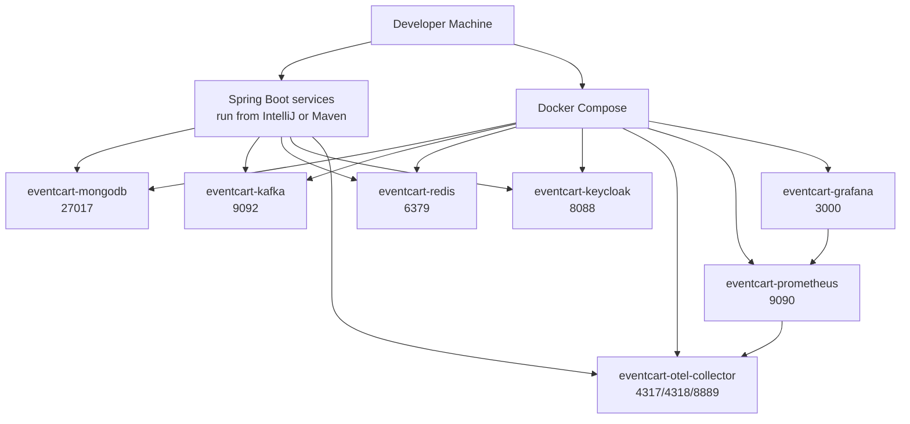
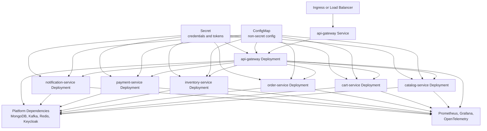

# Deployment View

This document explains how EventCart runs locally and how the same services map to a Kubernetes-style deployment.

## Local Docker Compose View

Local infrastructure is defined in [../../compose.yaml](../../compose.yaml).



Start local infrastructure:

```powershell
docker compose up -d
```

Run services from IntelliJ or Maven using their configured ports.

## Docker Image View

Each service has its own Dockerfile:

| Service | Dockerfile |
| --- | --- |
| API Gateway | `services/api-gateway/Dockerfile` |
| Catalog Service | `services/catalog-service/Dockerfile` |
| Cart Service | `services/cart-service/Dockerfile` |
| Order Service | `services/order-service/Dockerfile` |
| Inventory Service | `services/inventory-service/Dockerfile` |
| Payment Service | `services/payment-service/Dockerfile` |
| Notification Service | `services/notification-service/Dockerfile` |

Each Dockerfile uses Java 25 base images by default:

```text
eclipse-temurin:25-jdk
eclipse-temurin:25-jre
```

CI builds images through:

```bash
bash .github/scripts/docker-build-service.sh <service-name> <image-tag>
```

The script pre-pulls base images with retry and then builds the service image.

## Kubernetes View

Kubernetes manifests live under [../../ops/k8s](../../ops/k8s).



## Current Kubernetes Scope

The current manifests are application templates. They do not install MongoDB, Kafka, Redis, or Keycloak inside the cluster. In a production-style setup, these dependencies are usually managed by a platform team or cloud provider.

## Deployment Responsibilities

| Resource | Responsibility |
| --- | --- |
| Namespace | Groups EventCart resources. |
| ConfigMap | Stores non-secret environment values such as URLs and topic names. |
| Secret | Stores credentials and tokens. |
| Deployment | Runs service pods and controls replicas. |
| Service | Provides stable internal networking for pods. |
| Probes | Help Kubernetes restart or stop routing to unhealthy pods. |

## Operational Checklist

Before deployment:

1. Build and publish service images.
2. Create or update secrets.
3. Confirm MongoDB, Kafka, Redis, and Keycloak endpoints.
4. Apply namespace, config, secrets, deployments, and services.
5. Verify health endpoints.
6. Verify logs, metrics, and traces.

Useful commands:

```powershell
kubectl get pods -n eventcart
kubectl get svc -n eventcart
kubectl logs deployment/order-service -n eventcart
kubectl describe pod <pod-name> -n eventcart
```
