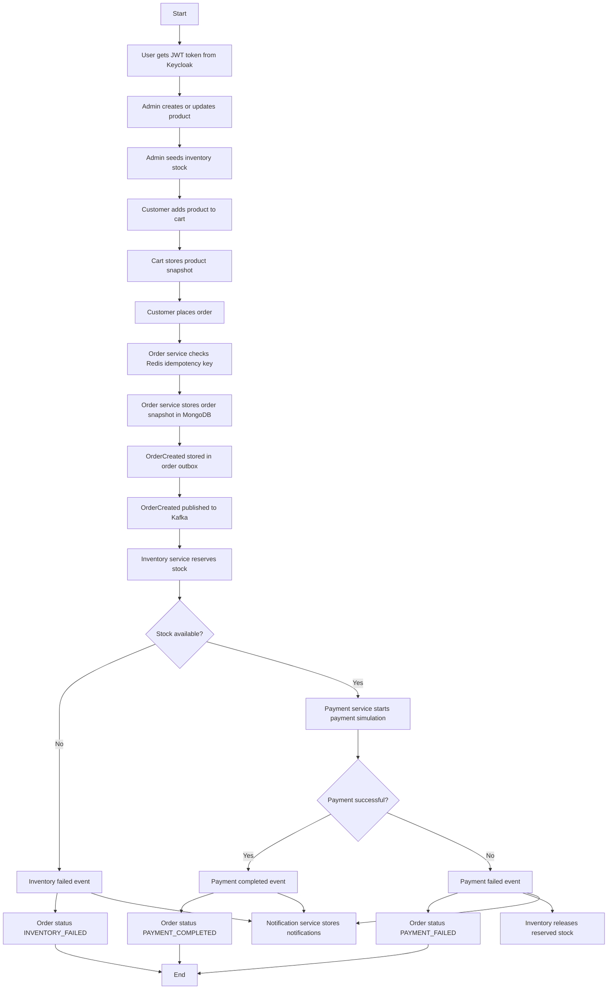
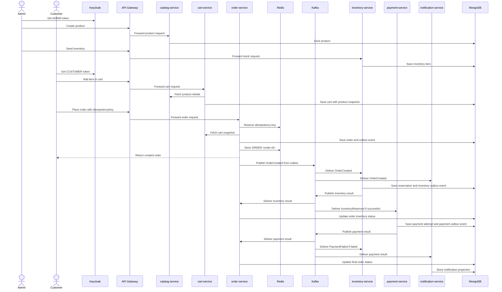
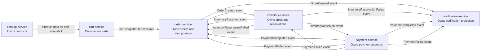
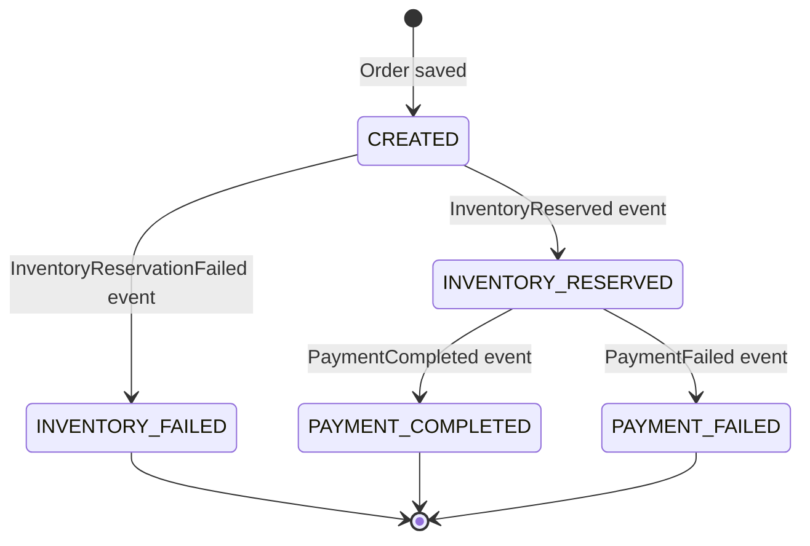
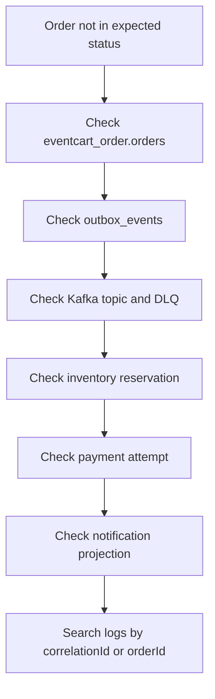

# Detailed Application Flow

This document explains the complete EventCart business process in a Confluence-style format. It is useful for QA, new joiners, debugging, and interview preparation.

## Page Summary

| Area | Details |
| --- | --- |
| Purpose | Explain the full customer order flow from product creation to notification. |
| Main entry point | API Gateway on `localhost:8080`. |
| Main services | catalog, cart, order, inventory, payment, notification. |
| Main infrastructure | MongoDB, Kafka, Redis, Keycloak. |
| Consistency model | Synchronous for cart/catalog/order request setup, asynchronous after order creation. |

## End-To-End Business Flow

## Request And Event Timeline

## API Calling Sequence

Use this sequence when manually testing the happy path.

| Step | Actor | API | Expected Result |
| --- | --- | --- | --- |
| 1 | Admin | Get Keycloak admin token | JWT with `ADMIN` role. |
| 2 | Admin | Create product | Product stored in `eventcart_catalog.products`. |
| 3 | Admin | Seed inventory | Stock stored in `eventcart_inventory.inventory_items`. |
| 4 | Customer | Get Keycloak customer token | JWT with `CUSTOMER` role and `customer_id`. |
| 5 | Customer | Add item to cart | Cart stored in `eventcart_cart.carts`. |
| 6 | Customer | Place order | Order stored in `eventcart_order.orders`; idempotency key stored in Redis. |
| 7 | System | Outbox publishes `OrderCreated` | Message appears on `eventcart.orders.created`. |
| 8 | System | Inventory reserves stock | Reservation stored in `eventcart_inventory.inventory_reservations`. |
| 9 | System | Payment is simulated | Payment attempt stored in `eventcart_payment.payment_attempts`. |
| 10 | System | Notifications are created | Notification stored in `eventcart_notification.notifications`. |
| 11 | Customer | Fetch order by ID | Final status becomes `PAYMENT_COMPLETED`, `PAYMENT_FAILED`, or `INVENTORY_FAILED`. |

## Service Responsibility Flow

## Order Status State Machine

## Failure Paths

| Failure | Where It Happens | Expected Behavior | Verification |
| --- | --- | --- | --- |
| Empty cart | order-service before event publishing | API returns `EMPTY_CART`; no order should be created. | Check response and `eventcart_order.orders`. |
| Duplicate order request | order-service Redis idempotency | Same idempotency key returns existing order after completion. | Check Redis key and order count. |
| Insufficient stock | inventory-service after `OrderCreated` | Order becomes `INVENTORY_FAILED`; no payment attempt is created. | Check order status, inventory reservation, notification. |
| Payment declined | payment-service after `InventoryReserved` | Order becomes `PAYMENT_FAILED`; inventory reservation is released. | Check payment attempt and inventory reservation status. |
| Kafka listener failure | Spring Kafka listener | Message retries and then moves to `.dlq`. | Consume matching DLQ topic. |

## Developer Debug Map

## Confluence Notes

If pasting into Confluence:

- Keep the section tables as-is.
- Paste Mermaid blocks into a Mermaid macro if available.
- If Mermaid is not available, paste the Mermaid source as code and attach exported diagram images later.
- Keep API sequence and debug map on the same page so QA can follow the process without jumping between pages.
