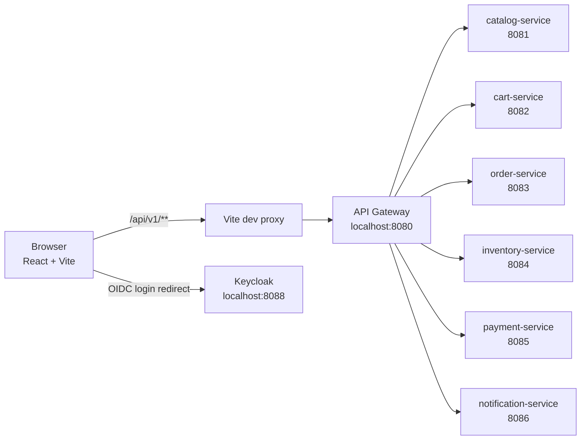
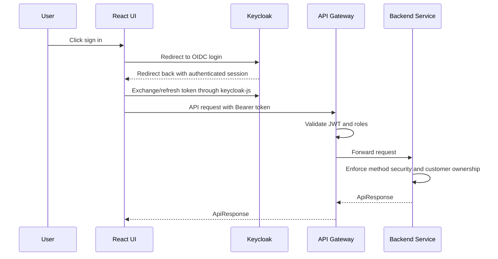
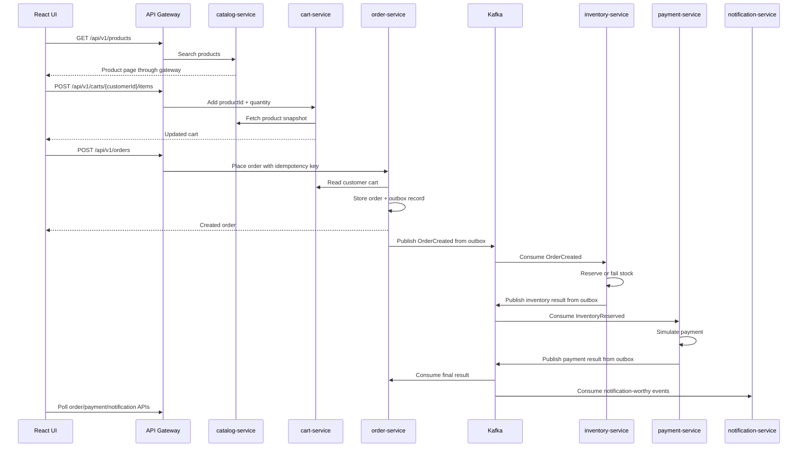

# Frontend UI Flow

This document explains how the React UI connects to the existing EventCart microservices platform.

## Runtime View

The React app does not call backend services directly. It calls `/api/v1/...`, Vite proxies the request to the API Gateway, and the gateway routes to the correct backend service.

## Authentication Flow

Important points:

- `customer-user` has role `CUSTOMER` and claim `customer_id=customer-1`.
- Admin/support users can switch the active customer ID in the UI.
- Customer users are locked to the `customer_id` from the token.
- API Gateway checks roles at the edge.
- Backend services still enforce authorization rules, so security does not depend only on the gateway.

## Customer Shopping Flow From UI

The UI uses polling on the Orders and Notifications screens because the backend workflow is asynchronous. This makes eventual consistency visible while you learn Kafka.

## React State Ownership

| State type | Owner | Example |
| --- | --- | --- |
| Server state | React Query | Products, cart, orders, inventory, payments, notifications |
| Auth state | Auth context + Keycloak JS | Token, username, roles, customer ID |
| Small workflow state | Zustand | Active customer ID, selected product ID, last order ID |
| Local form state | React Hook Form | Product create form, inventory form, cart add form |
| Temporary filter state | Component state | Catalog keyword/category filters |

This split is intentional. Server data is cached and invalidated through React Query. UI-only workflow state stays in Zustand. Form state stays close to the form that owns it.

## Debugging Checklist

| Symptom | Check |
| --- | --- |
| Login redirects fail | Confirm Keycloak client allows `http://localhost:5173/*` |
| API returns 401 | Confirm the user is signed in and the token is attached |
| API returns 403 | Confirm the user has the role and customer ownership claim needed |
| Catalog loads but cart fails | Product GET is public, but cart APIs require a customer/admin token |
| Order stays `CREATED` | Check Kafka, inventory-service, and order-service event listener logs |
| Payment is missing | Check payment-service and topic `eventcart.inventory.reserved` |
| UI shows stale data | Use React Query DevTools later or inspect polling/invalidation keys |
| Browser request has no correlation ID | Check `src/lib/apiClient.ts` interceptor |

## Interview Talking Points

- Why use an API Gateway from the browser instead of calling all microservices directly?
- Why does the UI poll order status instead of assuming the order is final immediately?
- What is the difference between frontend client state and backend server state?
- Why is React Query better than manually fetching in every component for this app?
- Why should a customer not be allowed to edit the active customer ID?
- Why is form validation done on the frontend even though the backend also validates?
- How does JWT authentication work in a single-page application?
