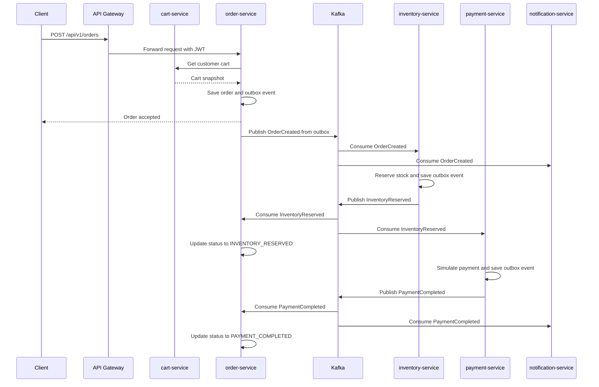
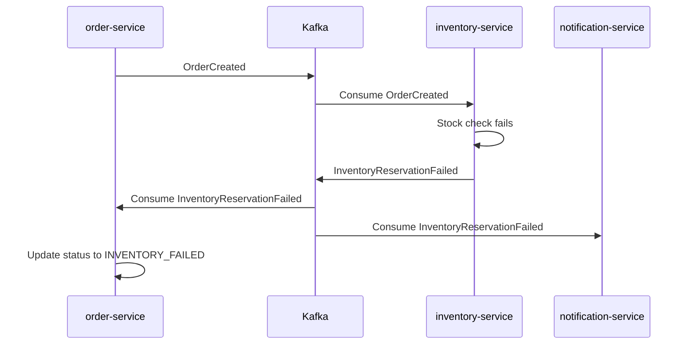
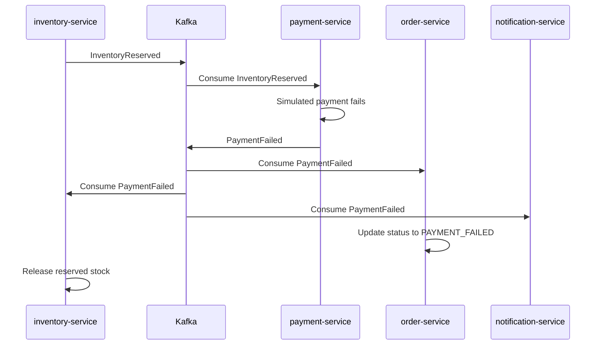
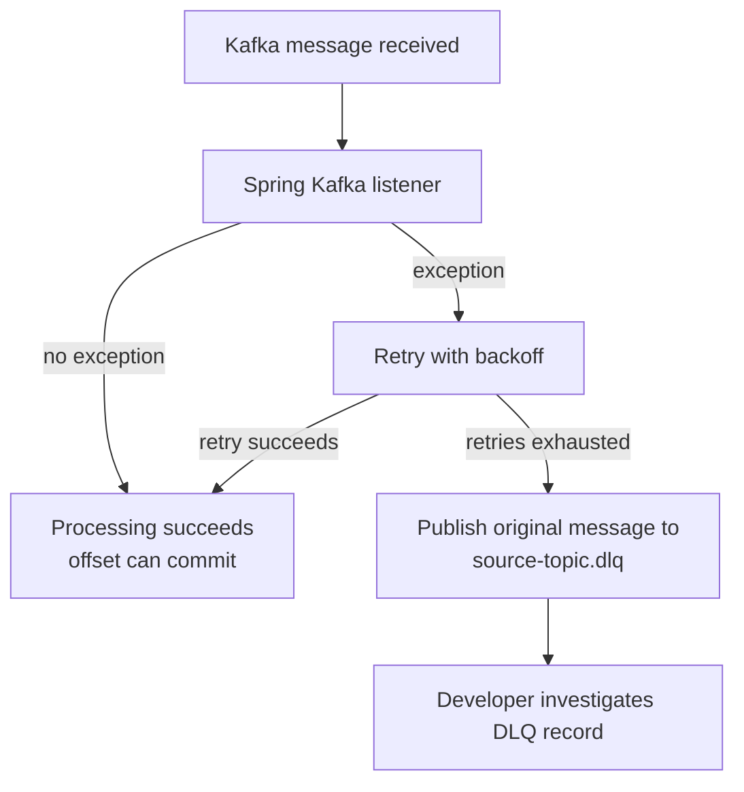
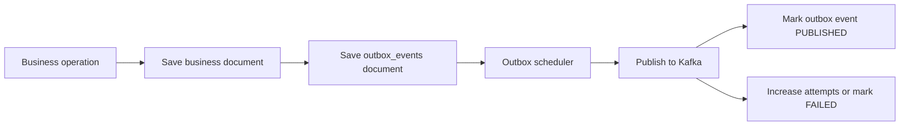

# Kafka Event Flow

Kafka is used for the asynchronous part of the EventCart order workflow. The goal is to decouple order placement from inventory reservation, payment processing, and notification projection.

## Topics

| Topic | Producer | Consumers | Purpose |
| --- | --- | --- | --- |
| `eventcart.orders.created` | order-service | inventory-service, notification-service | Order was created from a cart. |
| `eventcart.inventory.reserved` | inventory-service | order-service, payment-service | Stock was reserved successfully. |
| `eventcart.inventory.failed` | inventory-service | order-service, notification-service | Stock reservation failed. |
| `eventcart.payments.completed` | payment-service | order-service, notification-service | Payment completed successfully. |
| `eventcart.payments.failed` | payment-service | order-service, inventory-service, notification-service | Payment failed and inventory should be released. |

Each topic also has a matching dead-letter topic with `.dlq` suffix, for example `eventcart.orders.created.dlq`.

## Happy Path

## Inventory Failure Path

## Payment Failure And Compensation Path

## Retry And DLQ Flow

## Outbox Publishing Flow

## Debug Checklist

When an order does not reach the expected final status:

1. Check order-service logs for order placement and outbox messages.
2. Check `eventcart_order.orders` for order status.
3. Check `eventcart_order.outbox_events` for pending or failed events.
4. Check Kafka topic contents with `kafka-console-consumer`.
5. Check inventory-service logs and `eventcart_inventory.inventory_reservations`.
6. Check payment-service logs and `eventcart_payment.payment_attempts`.
7. Check notification-service logs and `eventcart_notification.notifications`.
8. Check `.dlq` topics when a listener throws repeatedly.

## Interview Talking Point

This is a choreography-based saga. No single orchestrator service tells every service what to do. Instead, each service reacts to events, updates its own state, and publishes the next event. This improves decoupling, but it requires idempotent consumers, good monitoring, retry/DLQ behavior, and clear event contracts.
