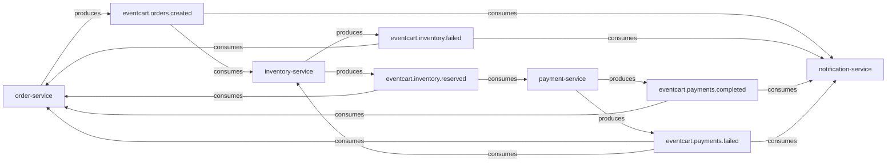
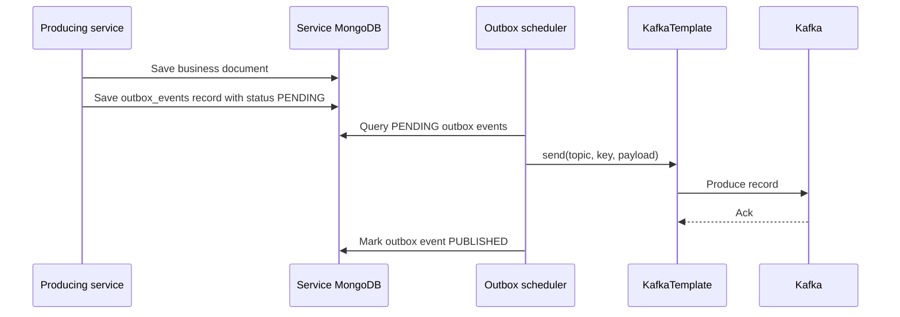
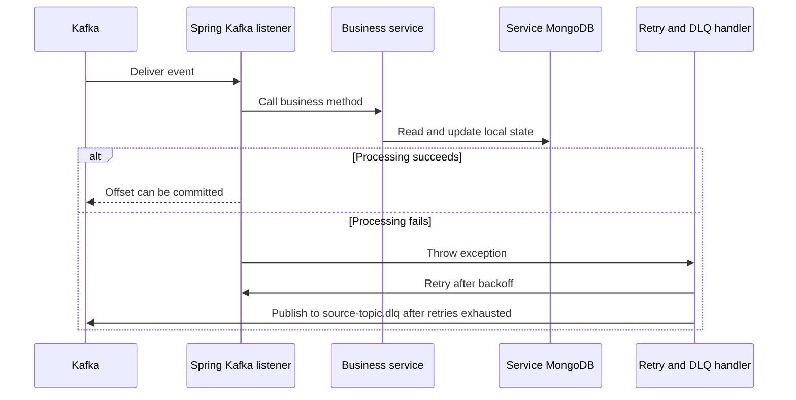
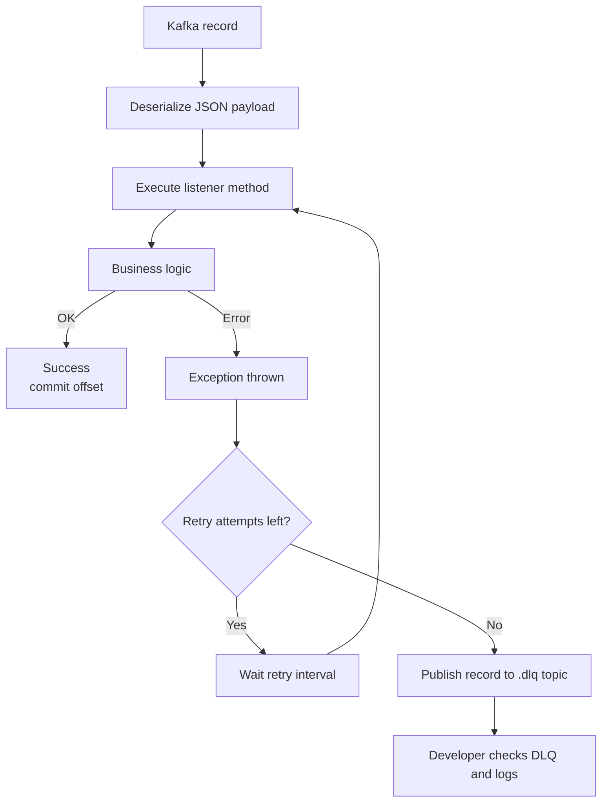
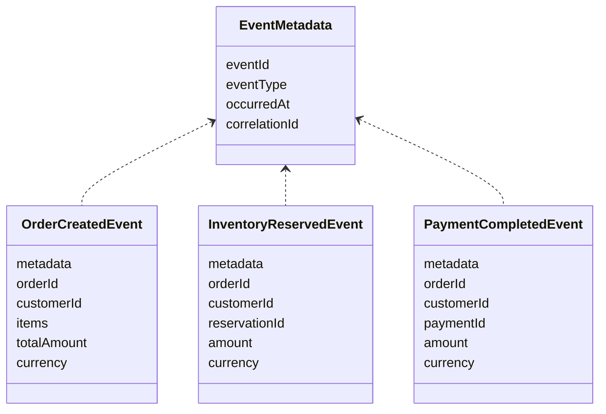

# Kafka Process Details

This document explains Kafka behavior in EventCart at a deeper process level: topic ownership, producer flow, consumer flow, retry, DLQ, and debugging.

## Page Summary

| Area | Details |
| --- | --- |
| Technology | Apache Kafka with Spring Kafka. |
| Purpose | Decouple order, inventory, payment, and notification workflows. |
| Delivery model | At-least-once. |
| Reliability helpers | Transactional outbox, idempotent consumers, retry, DLQ. |
| Main debug tools | Service logs, `kafka-console-consumer`, consumer group lag, DLQ topics. |

## Topic Ownership



## Producer Process

The services do not publish business events directly inside the main request path. They save outbox records first.



## Consumer Process



## Retry And DLQ Process



## Consumer Groups

| Consumer Group | Service | Why It Exists |
| --- | --- | --- |
| `inventory-service` | inventory-service | Reserves stock for each created order. |
| `order-service` | order-service | Updates order status from inventory and payment events. |
| `payment-service` | payment-service | Starts payment after inventory reservation. |
| `notification-service` | notification-service | Creates customer notifications from events. |

Different services use different consumer groups so they each receive the same event independently.

## Event Key Strategy

| Event | Kafka Key | Reason |
| --- | --- | --- |
| `OrderCreated` | `orderId` | Keeps all processing for one order ordered within a partition. |
| `InventoryReserved` | `orderId` | Order-service and payment-service process by order. |
| `InventoryReservationFailed` | `orderId` | Failure belongs to one order. |
| `PaymentCompleted` | `orderId` | Final order update belongs to one order. |
| `PaymentFailed` | `orderId` | Order update and inventory compensation belong to one order. |

## Event Payload Shape



## Kafka Debug Commands

List topics:

```powershell
docker exec -it eventcart-kafka /opt/kafka/bin/kafka-topics.sh --bootstrap-server localhost:9092 --list
```

Describe a topic:

```powershell
docker exec -it eventcart-kafka /opt/kafka/bin/kafka-topics.sh --bootstrap-server localhost:9092 --describe --topic eventcart.orders.created
```

Read order events:

```powershell
docker exec -it eventcart-kafka /opt/kafka/bin/kafka-console-consumer.sh --bootstrap-server localhost:9092 --topic eventcart.orders.created --from-beginning --max-messages 5
```

Read DLQ events:

```powershell
docker exec -it eventcart-kafka /opt/kafka/bin/kafka-console-consumer.sh --bootstrap-server localhost:9092 --topic eventcart.orders.created.dlq --from-beginning --max-messages 5
```

Check consumer lag:

```powershell
docker exec -it eventcart-kafka /opt/kafka/bin/kafka-consumer-groups.sh --bootstrap-server localhost:9092 --describe --group inventory-service
```

## Common Kafka Debug Scenarios

| Symptom | Most Likely Area | What To Check |
| --- | --- | --- |
| Order remains `CREATED` | Order outbox or inventory consumer | `eventcart_order.outbox_events`, `eventcart.orders.created`, inventory-service logs. |
| Order remains `INVENTORY_RESERVED` | Payment consumer or payment outbox | `eventcart.inventory.reserved`, payment-service logs, `eventcart_payment.outbox_events`. |
| Event appears multiple times | Retry or duplicate publish | Consumer idempotency logic and outbox status. |
| No consumer receives event | Topic/group config | Topic name properties and consumer group status. |
| Message in DLQ | Listener exception | DLQ payload, service logs, stack trace, bad data or missing local state. |

## Interview Explanation

"Kafka gives EventCart asynchronous service choreography. Each service owns its state and reacts to events. Since Kafka is at-least-once, the application uses idempotent consumers, retry, DLQ topics, and the transactional outbox pattern to make the flow reliable and debuggable."
