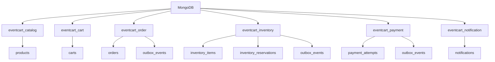
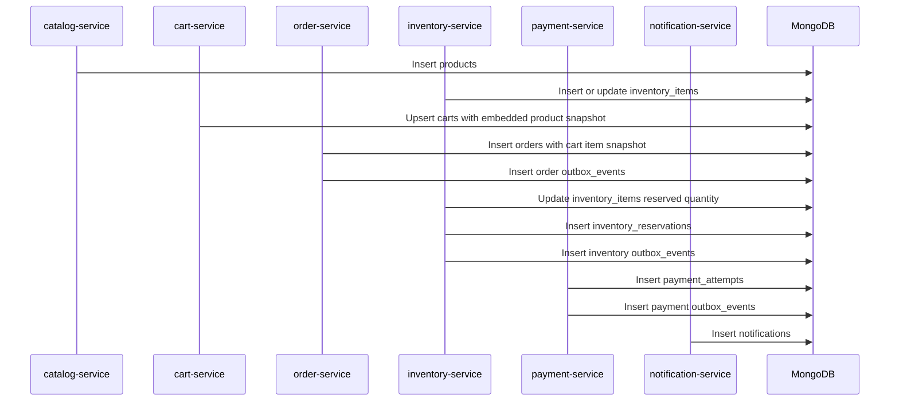
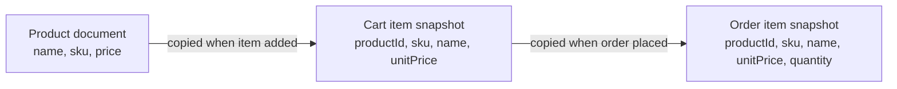
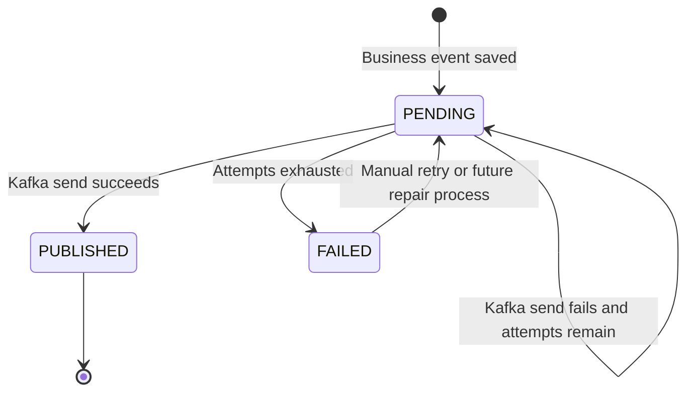
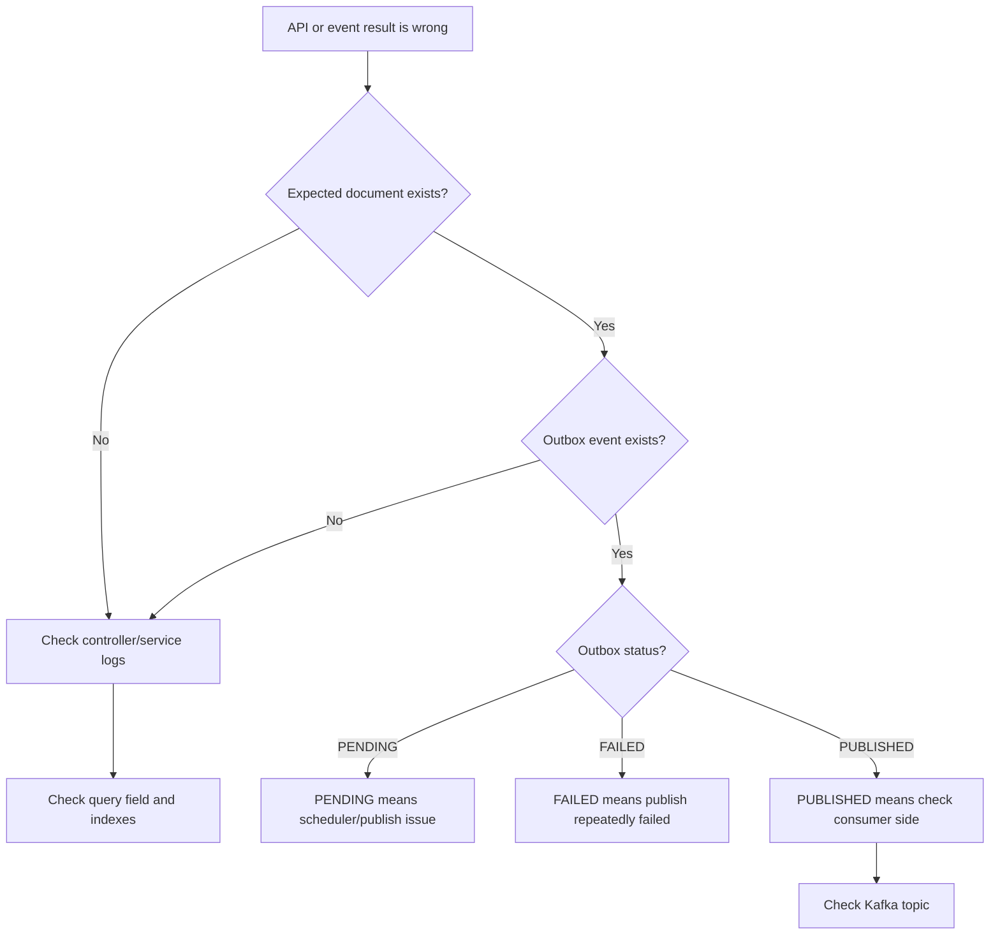

# MongoDB Process Details

This document explains how MongoDB is used in EventCart, including database ownership, document lifecycle, snapshots, outbox records, verification, and debugging.

## Page Summary

| Area | Details |
| --- | --- |
| Technology | MongoDB with Spring Data MongoDB. |
| Purpose | Store service-owned documents and outbox events. |
| Design style | Database per service, aggregate-oriented documents. |
| Important patterns | Snapshots, indexes, optimistic locking, auditing, transactional outbox. |

## Database Ownership Map



## Document Lifecycle In The Happy Path



## Snapshot Model

Cart and order documents intentionally store product snapshots.



Why this matters:

- Cart can show product details without constantly joining to catalog.
- Order history remains stable even if product name or price changes later.
- Services can own their documents independently.

## Outbox Document Flow



Outbox fields usually answer these questions:

| Field | Question It Answers |
| --- | --- |
| `aggregateType` | Which business aggregate produced the event? |
| `aggregateId` | Which order, reservation, or payment does this event belong to? |
| `eventType` | What kind of event is this? |
| `topic` | Which Kafka topic should receive it? |
| `eventKey` | Which Kafka key is used? |
| `payloadJson` | What payload will be published? |
| `status` | Is it pending, published, or failed? |
| `publishAttempts` | How many publish attempts happened? |

## MongoDB Writes By Service

| Service | Main Writes | Trigger |
| --- | --- | --- |
| catalog-service | `products` | Admin product APIs. |
| cart-service | `carts` | Customer cart APIs. |
| order-service | `orders`, `outbox_events` | Place order API and consumed Kafka events. |
| inventory-service | `inventory_items`, `inventory_reservations`, `outbox_events` | Admin stock APIs and consumed Kafka events. |
| payment-service | `payment_attempts`, `outbox_events` | Consumed `InventoryReserved` event. |
| notification-service | `notifications` | Consumed business events. |

## Verification Commands

Open Mongo shell:

```powershell
docker exec -it eventcart-mongodb mongosh -u eventcart -p eventcart --authenticationDatabase admin
```

Check products:

```javascript
use eventcart_catalog
db.products.find().pretty()
```

Check cart:

```javascript
use eventcart_cart
db.carts.find({ customerId: "customer-1" }).pretty()
```

Check order and outbox:

```javascript
use eventcart_order
db.orders.find({ customerId: "customer-1" }).pretty()
db.outbox_events.find().sort({ createdAt: -1 }).pretty()
```

Check inventory:

```javascript
use eventcart_inventory
db.inventory_items.find().pretty()
db.inventory_reservations.find().pretty()
db.outbox_events.find().pretty()
```

Check payment:

```javascript
use eventcart_payment
db.payment_attempts.find().pretty()
db.outbox_events.find().pretty()
```

Check notifications:

```javascript
use eventcart_notification
db.notifications.find({ customerId: "customer-1" }).pretty()
```

## Debug Decision Tree



## Best Practices Used

- Use one database per service.
- Use embedded documents for aggregate data loaded together.
- Use snapshots for order and cart history.
- Use indexes on lookup fields such as SKU, customer ID, status, and active flags.
- Use optimistic locking where concurrent updates are possible.
- Use DTOs at API boundaries instead of exposing documents directly.
- Use outbox records for event publishing reliability.

## Interview Explanation

"MongoDB is used as a service-owned document store. Carts and orders are aggregate-shaped, so embedded items and snapshots fit well. Each service owns its database, which keeps boundaries clear. The trade-off is that cross-service joins are not used; coordination happens through APIs and Kafka events."
