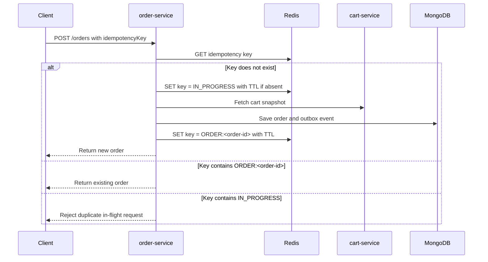
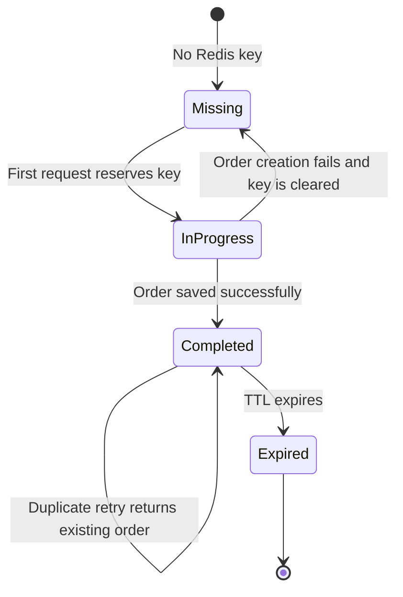
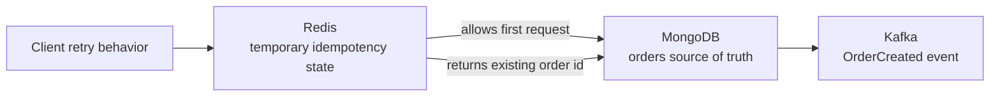
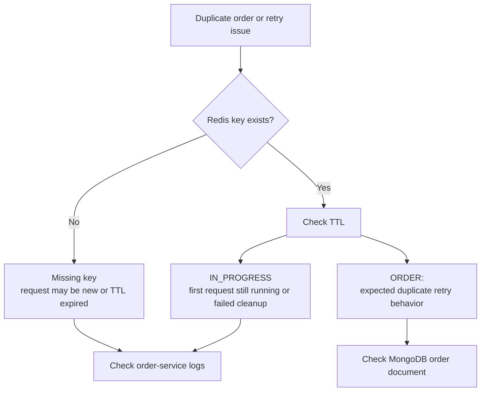

# Redis Process Details

This document explains how Redis is used in EventCart for order idempotency.

## Page Summary

| Area | Details |
| --- | --- |
| Technology | Redis with Spring Data Redis. |
| Used by | order-service. |
| Purpose | Prevent duplicate order creation when clients retry checkout requests. |
| Data type | String key/value. |
| TTL | 30 minutes by default. |

## Why Redis Exists In The Flow

Order placement is a risky operation to duplicate. A duplicate request can happen if:

- The client retries after a timeout.
- The user double-clicks a checkout button.
- The gateway or network drops the response.
- A mobile app retries automatically.

Redis gives order-service a fast atomic way to reserve and reuse an idempotency key.

## Key Design

Key:

```text
eventcart:orders:idempotency:<idempotencyKey>
```

Possible values:

| Value | Meaning |
| --- | --- |
| `IN_PROGRESS` | The first request is currently creating an order. |
| `ORDER:<order-id>` | The request completed and created this order. |

Default TTL:

```text
30m
```

## Idempotency Flow



## State Machine



## Duplicate Request Scenarios

| Scenario | Redis State | Expected Result |
| --- | --- | --- |
| First request | Missing | Reserve key and create order. |
| Same key while first request is still running | `IN_PROGRESS` | Return duplicate/in-progress error. |
| Same key after order completed | `ORDER:<order-id>` | Return existing order. |
| Same key after TTL expired | Missing | Treat as a new request. |
| Order creation fails before completion | `IN_PROGRESS` then cleared | Future retry can create order. |

## Redis And MongoDB Relationship



Redis does not own the order. It only stores retry coordination state. MongoDB remains the source of truth for orders.

## Verification Commands

Open Redis CLI:

```powershell
docker exec -it eventcart-redis redis-cli
```

List idempotency keys:

```text
KEYS eventcart:orders:idempotency:*
```

Read one key:

```text
GET eventcart:orders:idempotency:customer-1-order-20260802-001
```

Check TTL:

```text
TTL eventcart:orders:idempotency:customer-1-order-20260802-001
```

Expected values:

```text
IN_PROGRESS
ORDER:<order-id>
```

## Debug Decision Tree



## Developer Notes

- Always send an `idempotencyKey` from real checkout clients.
- Use a stable key for one checkout attempt, not a new key on every retry.
- Do not use Redis as the order source of truth.
- Keep TTL long enough for realistic client retries, but not permanent.
- Make failures clear `IN_PROGRESS` when order creation does not finish.

## Interview Explanation

"Redis is used to prevent duplicate orders during checkout retries. The first request reserves an idempotency key as `IN_PROGRESS`, then stores `ORDER:<order-id>` after success. A later retry with the same key returns the existing order. This is fast and atomic, but MongoDB is still the source of truth for orders."
