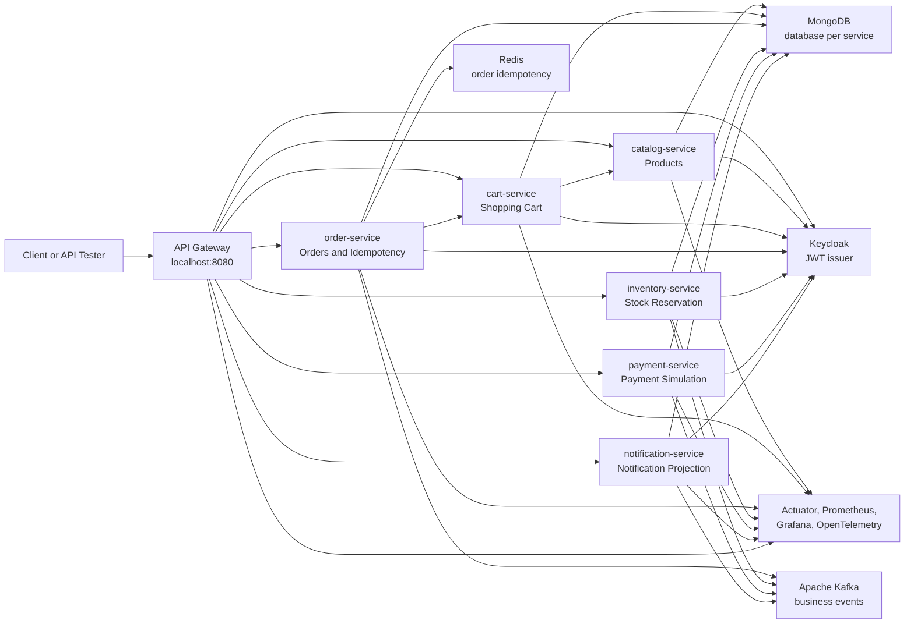

# System Overview

EventCart is a microservices-based real-time e-commerce order platform. It is designed for learning modern Java backend development with Spring Boot, MongoDB, Kafka, Redis, Keycloak, observability tooling, Docker, CI/CD, and Kubernetes-ready deployment.

## Main Goal

The system models the customer shopping flow:

1. A customer browses products.
2. A customer adds products to a cart.
3. A customer places an order.
4. Inventory is reserved asynchronously.
5. Payment is simulated asynchronously.
6. Order status is updated from Kafka events.
7. Notifications are stored and optionally delivered.

## High-Level Architecture

## Service Ports

| Service | Local Port | Responsibility |
| --- | --- | --- |
| API Gateway | `8080` | Single client entry point and edge JWT authorization. |
| Catalog Service | `8081` | Product catalog and product metadata. |
| Cart Service | `8082` | Customer cart and product snapshot in cart. |
| Order Service | `8083` | Order placement, order snapshot, Redis idempotency, order status. |
| Inventory Service | `8084` | Stock records, reservation, compensation after payment failure. |
| Payment Service | `8085` | Mock payment processing and payment result events. |
| Notification Service | `8086` | Customer notification history and optional delivery providers. |
| Keycloak | `8088` | Local identity provider and JWT issuer. |

## Infrastructure

| Component | Local Port | Used For |
| --- | --- | --- |
| MongoDB | `27017` | Service-owned document databases. |
| Kafka | `9092` | Event-driven order, inventory, payment, and notification workflow. |
| Redis | `6379` | Fast idempotency key store for order placement retries. |
| OpenTelemetry Collector | `4317`, `4318`, `8889` | Trace collection and metrics export. |
| Prometheus | `9090` | Metrics scraping and querying. |
| Grafana | `3000` | Dashboards and visual monitoring. |

## Data Ownership

Each service owns its own MongoDB database. Other services should not write directly into another service's database.

| Service | Database | Main Collections |
| --- | --- | --- |
| Catalog Service | `eventcart_catalog` | `products` |
| Cart Service | `eventcart_cart` | `carts` |
| Order Service | `eventcart_order` | `orders`, `outbox_events` |
| Inventory Service | `eventcart_inventory` | `inventory_items`, `inventory_reservations`, `outbox_events` |
| Payment Service | `eventcart_payment` | `payment_attempts`, `outbox_events` |
| Notification Service | `eventcart_notification` | `notifications` |

## Communication Style

EventCart intentionally uses both synchronous and asynchronous communication:

| Communication | Used Where | Why |
| --- | --- | --- |
| Synchronous HTTP | Cart to Catalog, Order to Cart | The caller needs immediate data to complete the current user request. |
| Kafka events | Order to Inventory to Payment to Notification | The workflow can continue asynchronously and each service can own its own state. |
| Redis command access | Order idempotency | Order placement retry checks must be fast and atomic. |

## Important Design Ideas

- API Gateway is the single external entry point.
- Backend services also validate JWTs so security is not only at the edge.
- Customer-owned resources are checked against the JWT `customer_id` claim.
- MongoDB documents store snapshots to preserve order and cart history.
- Kafka enables eventual consistency across order, inventory, payment, and notification.
- Transactional outbox reduces the chance of saving state without publishing the matching event.
- Kafka retry and DLQ behavior makes failed async processing visible and recoverable.
- Observability is part of the application, not an afterthought.
